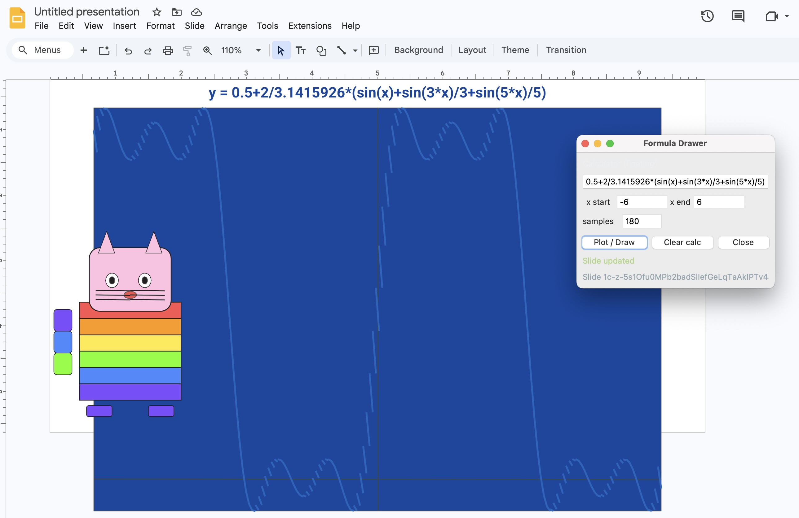

# Example: What You Can Build



This folder shows what's possible when you hand an AI agent (Claude CLI, Codex, etc.) the `skills/` library and point it at a live Google Slides presentation.

Three things were built in this example — each from a single natural-language prompt:

1. **Rainbow cat** — vector art drawn directly onto the slide
2. **Formula plotter** — a floating GUI that takes an x-y formula and renders it as a line on the slide
3. **Live clock** — a small program that rewrites a slide element with the current time every 5 seconds

None of the scripts in `scripts/` were written by hand. The AI agent wrote them.

---

## Prerequisites

Clone and set up the main repo first. From the [google-slides-drawing-skills](https://github.com/sphenelabsinc/google-slides-drawing-skills) root:

```bash
pip install -r requirements.txt
```

Follow the authentication steps in the main README to get your `credentials.json` and complete the OAuth flow. You'll also need a `config.json` with your `presentation_id`.

Once that's done, start the server — **the server must be running before any of this works**:

```bash
python3 run_server.py
```

---

## Setting Up Your Own Project

### Step 1: Create a New Folder

```bash
mkdir my-slides-project
```

A tracked git repo is better, even if it's not hosted on Github or something. It'll let you see at a glance what the AI created or modified.

```bash
cd my-slides-project
git init
```

### Step 2: Copy over the agent files

Copy the `skills/` folder and `AGENT.md` from the main repo into your new project:

```bash
cp -r /path/to/google-slides-drawing-skills/skills ./skills
cp /path/to/google-slides-drawing-skills/AGENT.md ./AGENT.md
```

These are the two things the AI agent needs to understand what it can do and how to do it.

**Optionally**, copy `scripts/send_command.py` as well — it's a simple TCP client the agent can use to execute commands directly from the shell. In this example, it wasn't used; the generated scripts communicated with the server on their own.

```bash
# optional
cp /path/to/google-slides-drawing-skills/scripts/send_command.py ./scripts/send_command.py
```

**Optionally**, if you set up git tracking, you can save the initial project state now.
```bash
# optional
git add .
git commit -m "Initial commit: project structure"
```

---

## Step 3: Open Claude CLI or Codex in Your Folder

Open your AI agent CLI (Claude Code, Codex, etc.) in the new project directory. The agent will discover `AGENT.md` and `skills/` automatically. **If not, you can always ask it to read them later.**

Let the agent read those files before giving it any tasks — `AGENT.md` tells it how the server works and how to compose drawing operations.

---

## Step 4: Give It Prompts

These are roughly the actual prompts used to produce the example:

**Rainbow cat:**
> "Use the skills to draw a rainbow cat on the slide."

The agent invented a `rainbow-art` skill on the fly (you can see it in `skills/rainbow-art/`) and then wrote a Python script. It could execute it too but maybe you do the execution manually, both is fine. The agent doesn't have to create the skill — it could have just drawn directly — but it chose to define it as reusable. In the next two prompts, you will see that the agent does not invent new skills.

**Formula plotter:**
> "Make a simple floating GUI program in python to draw an x-y plot of formulas on the slide. Use as default 0.5+2/3.1415926*(sin(x)+sin(3*x)/3+sin(5*x)/5). Use the skills available to you."

The agent wrote `scripts/calculator_gui.py` — a Tkinter window where you type a formula, hit draw, and it renders the curve as a polyline on the slide.

**Live clock:**
> "Update the slide with a clock every 5 seconds. Use the skill available to you. Give me a runnable .py"

The agent wrote `scripts/updating_app.py`, which loops every 5 seconds, gets the current time, and pushes it to a text element on the slide.

---

## What This Demonstrates

- The agent doesn't need to know the Google Slides API — the skills abstract it away
- You can build interactive apps that talk to the local server then ultimately the slide in real time. It can be node.js apps... as long as it knows how to connect with the socket server.
- The prompts are casual and short; the agent does the heavy lifting
- Skills can be extended or invented by the agent mid-session

The more skills you give it, the more it can do.
